# 臺灣 YouTube 頻道策略分析與優化（Python）

[Colab Notebook 完整文字內容及程式碼在這裡](https://github.com/ThomasTsao47/Youtube_Project/blob/main/Files/Youtube_data_project.ipynb)

## 0.目錄
1. 專案概述
2. 資料來源
3. 工具使用
4. 套件載入
5. 資料收集<br>
  5-1 載入 YOUTUBE API KEY<br>
  5-2 取得 channelId<br>
  5-3 Channel<br>
  5-4 Playlist<br>
  5-5 Video<br>
  5-6 VideoCategory<br>
  5-7 Comment<br>
6. 資料合併
7. 資料探索及清洗
8. 資料分析<br>
  8-1 頻道總訂閱數，總影片數，總觀看數<br>
  8-2 每月平均觀看數<br>
  8-3 觀眾互動程度<br>
  8-4 每月發布影片數及影片平均長度<br>
  8-5 影片發布時間<br>
  8-6 影片最常設定的標籤（Tags）<br>
  8-7 觀看數最多的影片標題<br>
  8-8 影片標題及影片說明的字數 & 標籤使用數量<br>
9. 結論
10. 建議
11. 參考資料

## 1.專案概述
為了解臺灣知名 Youtube 頻道（包含Joeman，木曜4超玩，志祺七七X圖文不符，Dcard Video，Men's Game 玩物誌）經營 YT 的相關策略及表現，因此透過 YouTube Data API 取得所需資料，並使用 Google Colab Notebook 分析頻道訂閱數，影片數，觀看數，觀眾互動程度，影片發布策略，影片文字設定策略等，以了解各頻道間的差異，並提供相關決策建議，期望提升影片點擊率及吸引目標用戶。

## 2.資料來源
* 資料來源：[YouTube Data API](https://developers.google.com/youtube/v3/getting-started?hl=zh-tw)
* 資料期間：由各頻道成立起至2024年4月27日（後續分析會排除上傳時間在2024年3月31日之後的影片，而在2024年4月1日之前上傳的影片皆會統計到2024年4月27日）
* 資料集：[Datasets](https://github.com/ThomasTsao47/Youtube_Project/tree/main/Data)

## 3.工具使用
* Python 3.10.12（requests，pandas，matplotlib，seaborn，os，asyncio，aiohttp，tqdm，nest_asyncio，ast，re）
* [YouTube Data API (v3)](https://developers.google.com/youtube/v3/getting-started?hl=zh-tw)

## 4.套件載入
```
# 安裝套件（用於處理異步 HTTP 請求的庫）
!pip install aiohttp
```

```
# 載入套件
import requests
import pandas as pd
import matplotlib.pyplot as plt
import seaborn as sns
import os
import asyncio
import aiohttp
from tqdm import tqdm
import nest_asyncio
import ast
import re
from matplotlib.font_manager import FontProperties as font
```

## 5.資料收集
以下先透過 API 取得 channelId，再透過 channelId 依序取得頻道，播放清單，影片，影片類型及觀眾留言資料，並將資料存進個人雲端硬碟。

說明：
* 使用 Youtube Data API 中的大多數方法會消耗1點 quota cost，而無效的請求也會產生至少1點的 quota cost；另外如果使用會傳回多頁結果的方法（如search.list），則每個檢索附加結果頁的請求都會產生額外的 quota cost。
* Google Cloud API Quota Cost 歸零時間是台灣時間每日下午3點
* Queries per day limitation（Youtube Data API）：10,000
* [YouTube Data API (v3) - Quota Calculator](https://developers.google.com/youtube/v3/determine_quota_cost)
  
### 5-1 載入 YOUTUBE API KEY
### 5-2 取得 channelId
### 5-3 Channel
### 5-4 Playlist
### 5-5 Video
### 5-6 VideoCategory
### 5-7 Comment

## 6.資料合併
因取得上述資料的過程有可能發生連線中斷的問題，所以在資料取得後皆先存進雲端硬碟，下面再從雲端路徑將各個檔案讀取進來並做合併。

## 7.資料探索及清洗
* 檢查是否有重複值
* 處理缺失值
* 調整資料型態
* 排除異常資料(影片未播，影片測試等)
* published_at 欄位為 ISO 8601 時間長度，因此將其轉換為分鐘(取到小數點後1位)，並創建一個新的欄位存儲轉換後的分鐘數
* 篩選上傳時間最晚為 113/3/31 當天結束為止的影片

**清洗後資料**：<br>
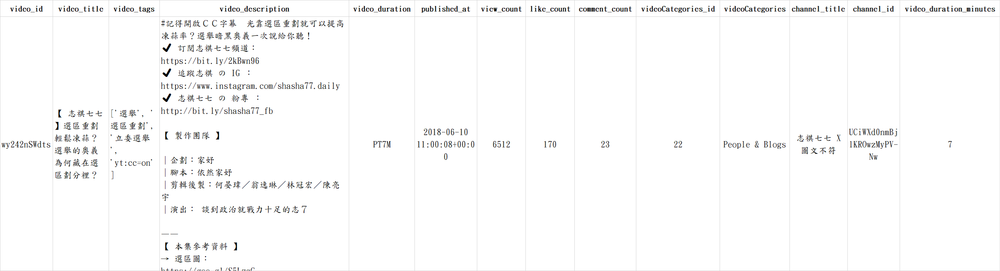<br><br>
**筆數及型態**：<br>
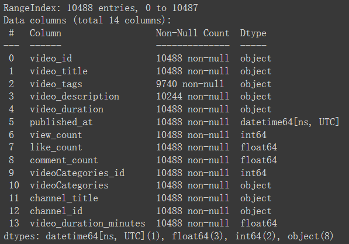<br><br>

## 8.資料分析
以下分析的資料包含 Youtube 所有的影片類型：一般影片，shorts，直播，Podcast

### 8-1 頻道總訂閱數，總影片數，總觀看數
頻道成立時間先後排序為：Men's Game 玩物誌（2007年），Joeman（2010年），Dcard Video（2016年），木曜4超玩（2017年），志祺七七X圖文不符（2018年）。

首先初探幾個宏觀指標，包含總訂閱數，總影片數，總觀看數，以了解各頻道目前的情況，並展開後續的分析。<br>

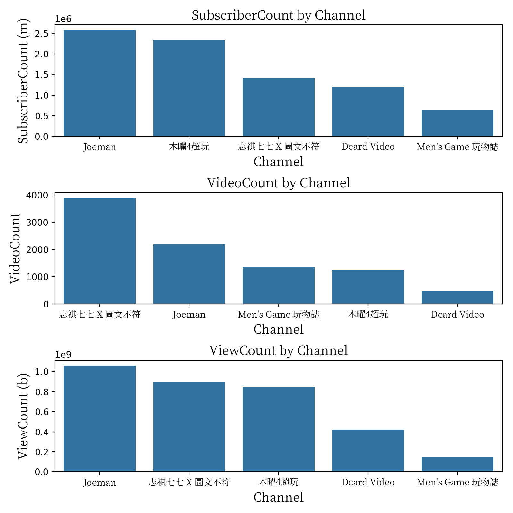<br>
<sub>
分析資料期間：由頻道成立起至2024年4月27日<br>
</sub>

概覽頻道的幾個宏觀指標（以下指標皆由大至小排序，數字為約略數）：
* 總訂閱數前三：Joeman（258萬），木曜4超玩（234萬），志祺七七X圖文不符（142萬）
* 總影片數前三：志祺七七X圖文不符（3,891支），Joeman（2,193支），Men's Game 玩物誌（1,353支）
* 總觀看數前三：Joeman（10億6千萬次），志祺七七X圖文不符（8億9千萬次），木曜4超玩（8億4千萬次）

上圖發現 "志祺七七X圖文不符" 頻道最晚成立，然而可能因發布影片數最多，使得總觀看數位居第2，總訂閱數位居第3。

### 8-2 每月平均觀看數
此部分觀察各頻道影片於每月的平均觀看數，以了解影片觀看情形隨時間的變化。這裡不選擇觀察較短的時間周期（如每日，每周），因為資料點會太密集而造成趨勢變化觀察不易。

補充：因為無法取得影片隨時間演進的觀看數變化，因此我們假設每支影片的觀看數的主要貢獻是集中在影片上傳後的一個月內，以方便了解觀看數的趨勢變化。

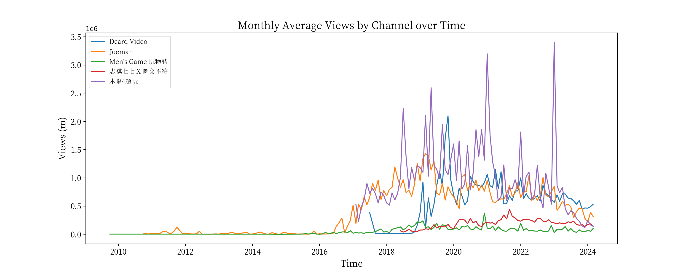<br>
<sub>
分析資料期間：由頻道成立起至2024年4月27日<br>
</sub>

上圖可發現2016年以前僅有兩個頻道存在，且觀看數變化不大，因此下面針對2016年以後的資料進行分析

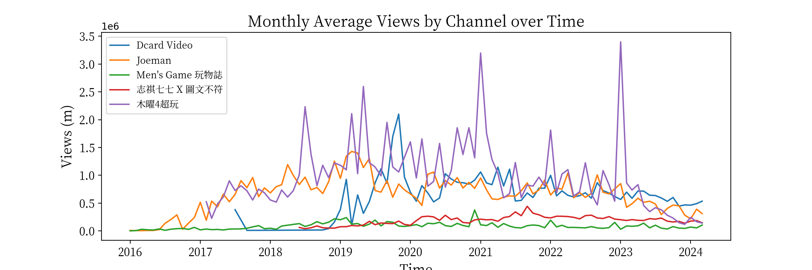<br>
<sub>
分析資料期間：2016年1月1日至2024年4月27日<br>
</sub>

觀察每月平均觀看：
* "木曜4超玩"：2023年以前落在100萬以上
* "Joeman" 及 "Dcard Video"：2020至2023年間，約落在50萬至100萬
* "志祺七七X圖文不符" 及 "Men's Game 玩物誌"：約落在50萬以下

2023年以後，多數頻道的觀看數皆呈現下降趨勢，可能原因為近年自媒體盛行使得Youtube平台的越趨競爭，而導致流量紅利逐漸變小。

### 8-3 觀眾互動程度
觀察"影片得到觀眾按讚的比率"及"影片得到觀眾留言的比率"，以了解不同頻道下，觀眾與頻道主的互動程度。

建立指標：
* like_per_view(%)：Number of Likes / Number of Views * 100
* comment_per_view(%)：Number of Comments / Number of Views * 100

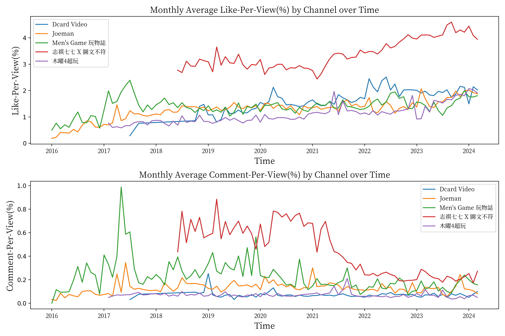<br>
<sub>
分析資料期間：2016年1月1日至2024年4月27日<br>
</sub>

觀察每月平均按讚比例及留言比例：
* "志祺七七X圖文不符" 相較其他4個頻道的按讚比例明顯較高，且隨時間呈上升趨勢；而留言比例亦相較其他4個頻道來得高，但隨時間呈下降趨勢。（可能原因請見下一節：每月發布影片數及影片平均長度）
* "Men's Game 玩物誌" 的留言比例在2018年後持續位於前段第2，查看發現頻道主較常回應觀眾留言。此外，在2017年5月份有較高比例的留言數，查看發現當月份有支抽獎活動的影片帶動起後續幾日其他影片留言數的居高

### 8-4 每月發布影片數及影片平均長度
了解不同頻道的發片頻率及長短影片策略對觀看情形的可能影響也非常重要，有助於調整優化發布策略以吸引留存目標觀眾。

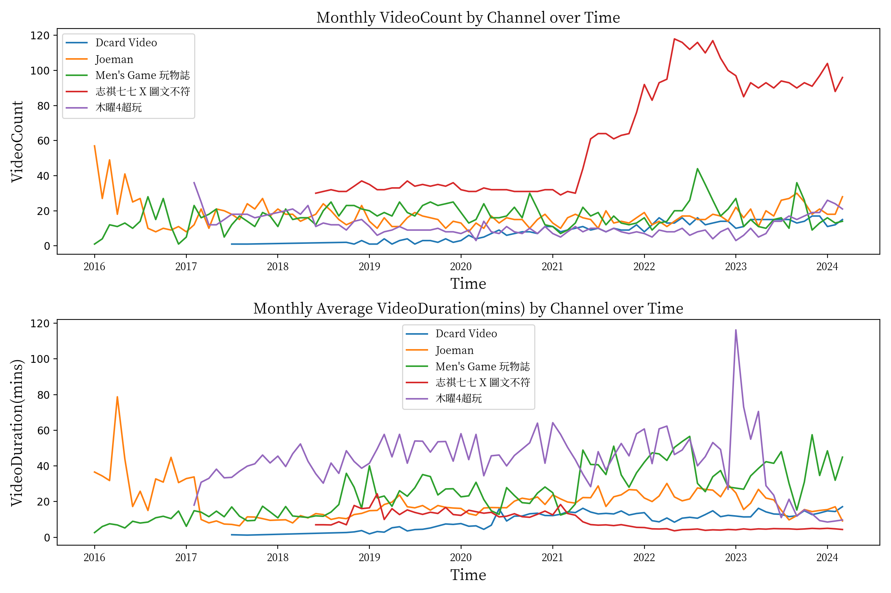<br>
<sub>
分析資料期間：2016年1月1日至2024年4月27日<br>
</sub>

觀察每月發布影片數：
* "志祺七七X圖文不符" 一開始是每月發布約30支影片，自2021年5月開始錄製短影音shorts而提升到每月約60支影片，自2022年1月以後則提升到90支，可能為造成上述按讚比例及留言比例有明顯變化的原因
* 除 "志祺七七X圖文不符" 以外的4個頻道，每月發布影片數平均都落在30支以下

觀察每月發布影片平均長度：
* "木曜4超玩" 在2022年11月以前皆發布長影片居多，2022年11月以後開始發布較多shorts短影片，可能是造成上述每月平均觀看數在2023年以後逐漸下降的原因，也說明它原本的主要觀眾應是較喜歡長影片內容的觀眾群，因此建議該頻道保持主打一貫的長影片風格，應能較好的發揮優勢，改善其下降的觀看數
* "志祺七七X圖文不符" 及 "Dcard Video" 的影片多數落在20分鐘以內，可能說明兩者皆嚴格執行特定的影片長度策略

下面進一步查看所有頻道的影片，比較影片時間小於2分鐘及超過2分鐘，分別在按讚比例及留言比例上的差別，發現短影音確實更容易取得讚數，但較不會獲得觀眾留言。<br>
<br>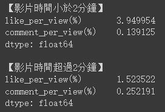<br><br>

### 8-5 影片發布時間
透過影片發布時間可了解各頻道是否考慮了觀眾看YT影片的時間習慣，或是僅僅只是按照上班時的工作習慣進行影片發布。

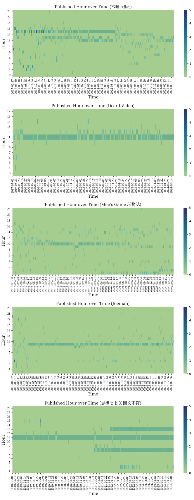<br>
<sub>
分析資料期間：2016年1月1日至2024年4月27日<br>
</sub>

觀察影片發布時間：
* "木曜4超玩" 在2022年11月以前主要集中在中午12點至15點，2022年11月以後則較不固定，大概是因為該時間點以後多了短影片，拍攝所需時間較短，能較隨意發布
* "Dcard Video" 及 "Joeman" 主要集中在早上10點至12點發布影片，判斷兩者應該都是提前錄製好影片，因此皆設定好固定上片的時間
* "Men's Game 玩物誌" 在2022年8月以後有一部分集中在凌晨12點至1點，推測有可能想吸引海外的觀眾
* "志祺七七X圖文不符" 集中在早上8,11,13點，查看發現該頻道每日約上傳2支短影片及1支一般影片

整體來說，發布時間多數落在白天10點至15點，而若對照每月平均觀看數來看，或許嚴格遵守同一時間的發布是個可行的策略。

### 8-6 影片最常設定的標籤（Tags）
標籤的設定有其重要性，通常是影片的關鍵字，能幫助觀眾尋找特定的影片內容，以提升點閱率。此外，下面透過分析各頻道不同時期所設定的前10名標籤，可了解影片主題類型的變化趨勢。

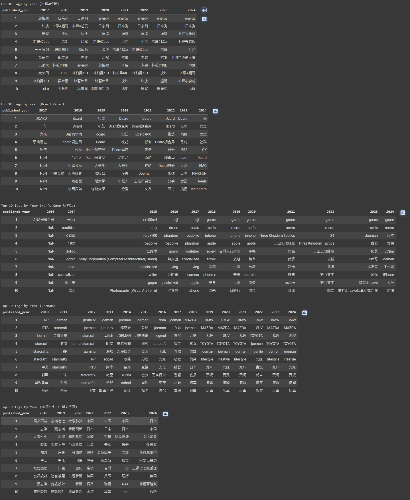<br>
<sub>
分析資料期間：由頻道成立起至2024年4月27日<br>
</sub>

觀察影片最常設定的標籤：
* "木曜4超玩" 常設標籤可以看出該頻道主要的常態性參與人及常見的影片系列，像是"一日系列" 及 "下班去吃飯" 等
* "Dcard Video" 主要透過街訪，校訪的方式討論有關男女生，大學生的話題，而常見的影片系列如"Dcard尋奇"，"Dcard調查局"等
* "Men's Game 玩物誌" 該頻道從早期介紹公路車，科技3C，遊戲，到後來拍攝旅遊，開箱，養老等話題
* "Joeman 常設標籤包含遊戲，實況，汽車等，但該頻道實際上在過去也有許多3C的開箱影片，以及系列影片如"Joe是要對決"，這部分皆沒出現在標籤中，判斷應是頻道主沒有設定該類標籤，因此建議可增加相關標籤，方便觀眾更好找到相關影片
* "志祺七七X圖文不符" 主要探討時事新聞，國際議題，另外可看出近年所使用的標籤文字更加具體

### 8-7 觀看數最多的影片標題
從觀看數最多的影片中可了解標題如何設定較能夠吸引觀眾眼球，進而提升點擊率。因此，下面我們找出各頻道最多觀看數的前10名影片。

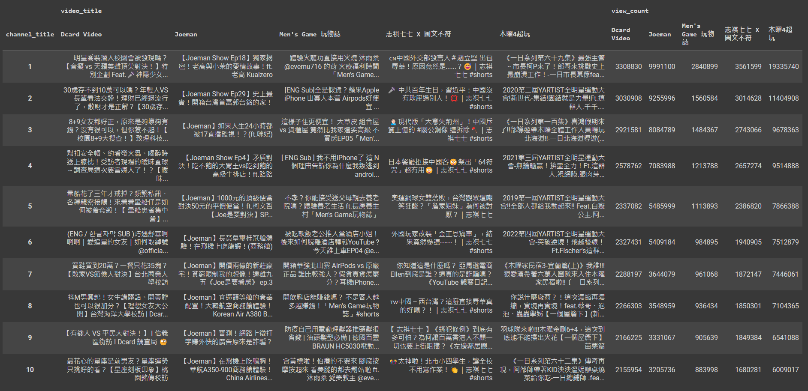<br>
<sub>
分析資料期間：由頻道成立起至2024年4月27日<br>
</sub>

分析觀看數最多的影片標題：
* "Dcard Video" 標題主要與存款，8+9女友好正，暈船，消費習慣等文字有關，其中有將近半數的影片都有使用對比不同群體的文字（如敗家&節儉，有錢人&平民），而有明星客串在內的影片佔了2部
* "Joeman" 前5名的影片都有網紅或知名人物的客串（如老高，郭台銘），而飛機搭乘體驗佔了3部，對決高檔與平價系列的影片則佔了2部
* "Men's Game 玩物誌" 有女網紅客串的影片佔據第1，另外有提到IPhone的文字也較為熱門。此外，也有用到具對比意思的文字（組合屋vs貨櫃屋，山寨vs正品）
* "志祺七七X圖文不符" 標題主要是跟兩岸議題，國際議題，新聞時事有關，其中shorts短影音竟佔了7部，說明該頻道的shorts影片可能相較一般影片來得更吸引觀眾
* "木曜4超玩" 前6名的影片主要是包含影片系列的文字，如"一日系列"，"全明星運動會"等。此外，該頻道有兩部破千萬觀看的影片皆有相關知名人物的客串

整體來說，除"志祺七七X圖文不符"以外的4個頻道，第一名的影片皆有網紅或知名人物客串在內。此外，對比類型的影片標題也是獲得高觀看數的可能原因。

### 8-8 影片標題及影片說明的字數 & 標籤使用數量
最後查看各頻道對於與影片內容有關的文字設定是否遵循特定規律。

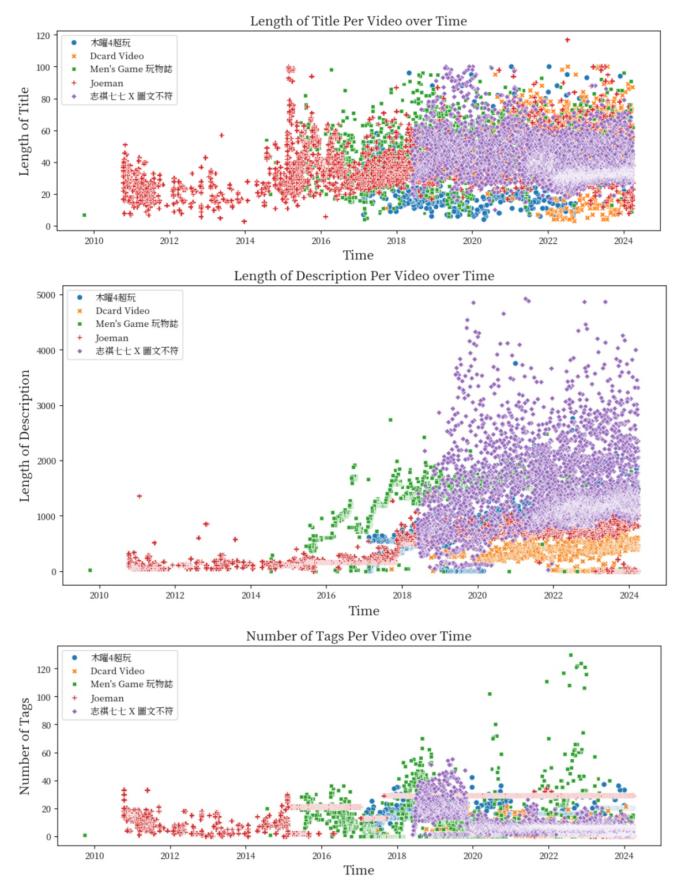<br>
<sub>
分析資料期間：由頻道成立起至2024年4月27日<br>
</sub>

觀察影片標題的字數：
* 無發現特定規律
觀察影片說明的字數：
* "志祺七七X圖文不符" 相較其他4個頻道所使用的影片說明字數來的多，查看發現該頻道在說明區裡放的內容涵蓋了製作團隊，影片分節內容，參考資料及相關連結等較詳盡的資料
觀察影片使用的標籤數量：
* "Joeman" 在2019年以後使用標籤的數量幾乎都是29個，對照上述"影片最常設定的標籤"章節，確實觀察到在該年以後的標籤使用幾乎沒變，說明該頻道主應是已不太在意標籤的設定及使用數量
* "Dcard Video" 是所有頻道中最不常使用標籤的

整體而言，並無觀察到各頻道對於上述三個部分有特定的設定規律。

## 9.結論
* 為了解臺灣知名 Youtube 頻道的經營策略及表現，因此透過 API 取得 5 個頻道的資料，並使用 Python 分析頻道訂閱數，影片數，觀看數，觀眾互動程度，影片發布策略，影片文字設定策略等，以了解各頻道間的差異，並提供相關決策建議，期望提升影片點擊率及吸引目標用戶
* 2023 年以後，多數頻道的月平均觀看數皆呈現下降趨勢，可能是近年自媒體盛行使得 Youtube 平台的越趨競爭，而導致流量紅利逐漸變小
* 分析所有頻道的影片，發現短影音更容易取得讚數，但較少獲得觀眾留言
* "志祺七七X圖文不符" 及 "Dcard Video" 的影片多數落在20分鐘以內，可能說明兩者皆嚴格執行特定的影片長度策略
* 除"志祺七七X圖文不符"以外的4個頻道，各自觀看數第一名的影片皆有網紅或知名人物客串在內。此外，對比類型的影片標題也是獲得高觀看數的可能原因

## 10.建議
* "木曜4超玩" 在2022年11月以前皆發布長影片居多，2022年11月以後開始發布較多shorts短影片，可能是造成上述每月平均觀看數在2023年以後逐漸下降的原因，也說明它原本的主要觀眾應是較喜歡長影片內容的觀眾群，因此建議該頻道保持主打一貫的長影片風格，應能較好的發揮優勢，改善其下降的觀看數
* "Joeman" 頻道內容中有許多3C的開箱影片，以及系列影片如"Joe是要對決"，這部分皆沒出現在標籤中，因此建議可增加上述類型標籤，方便觀眾更好找到相關影片

## 11.參考資料
* [新創如何與 YouTuber 合作，借助他們的影響力](https://appworks.tw/startup-youtuber-marketing/)
* [YouTube Data API (v3) - Quota Calculator](https://developers.google.com/youtube/v3/determine_quota_cost)
* [Youtube行銷怎麼做？最新Youtube行銷策略和短影音分析看這裡](https://twfirst.com.tw/digital-marketing/youtube-marketing/)
* [如何提升 YouTube 點閱率？YouTube 標籤是什麼？為什麼很重要？](https://tw.cyberlink.com/blog/youtube-video-editing/543/youtube-seo)
* [台灣YouTube頻道訂閱人數排行榜](https://zh.wikipedia.org/wiki/%E5%8F%B0%E7%81%A3YouTube%E9%A0%BB%E9%81%93%E8%A8%82%E9%96%B1%E4%BA%BA%E6%95%B8%E6%8E%92%E8%A1%8C%E6%A6%9C)
* [訂閱人數最多的YouTube頻道](https://zh.wikipedia.org/wiki/%E8%AE%A2%E9%98%85%E4%BA%BA%E6%95%B0%E6%9C%80%E5%A4%9A%E7%9A%84YouTube%E9%A2%91%E9%81%93)


